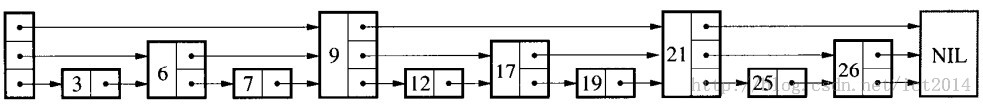

**Redis**

**redis的线程io模型**

redis是单线程的，这句话并不准确。

redis在处理客户端请求时，包括获取（socket读）解析，执行，返回（socket写），等都是由一个顺序串行的主线程处理。这就是以前说的单线程。但是redis4.0之后，也不是完全的单线程，后台也开了线程处理较慢的操作，删除大key等。

redis6.0之后加入了多线程。

redis的数据都在内存里面，所有运算都是内存级别的运算。要小心某些耗时特别长的指令，可能会对redis造成卡顿。

以前的redis是单线程，但为什么能处理那么多并发客户端的连接？那是因为redis用了采用了IO的多路复用。

* socket

在说多路复用前，需要先了解socket。socket是我们操作系统提供给我们的接口。当客户端和服务器使用tcp通讯时，客户端封装一个请求对象req，将请求对象req序列化成字节数组。然后通过套接字将数组发送到服务器。服务器再反序列化成请求对象req进行处理。


这个socket对象存放在操作系统的内核中，有读缓冲和写缓冲。都是有限大小的数组结构。写字节时就是将字节数组复制到内核套接字对象的写缓冲中。读其实就是将读缓冲中的数组读出，在内存中反序列化。

socket给我们提供的两个方法，read和write默认是阻塞的。但是也可以设置成非阻塞。非阻塞就是能读多少读多少，能写多少写多少。实际读了多少会有返回值来告诉程序。这样读写就能瞬间完成，然后线程就可以干别的事情了。

* IO多路复用

上面讲了将socket的读写方法设置成非阻塞，但是其实还不完整。因为都是读了写了就返回了，线程不知道什么时候才继续读和写。

这个时候就要用到操作系统给我们的事件轮询api。这里以select为例。

```
read_events, write_events = select(read_fds, write_fds, timeout)
for event in read_events:
    handle_read(event.fd)
for event in write_events:
    handle_write(event.fd)
handle_others()
```

read_fds和write_fds表示读和写的描述符。每个客户端socket都有对应的读写描述符。除此之外还设置了过期时间timeout。这个每个select只要有读写事件就会马上返回，等不到也会有timeout过期返回。然后线程又进入了下一个循环，成了一个死循环。这就是redis的事件循环。

redis的事件循环：


因为select系统调用可以同时处理多个通道描述符的读写事件，就称这个为多路复用api。现代的多路复用api已经不使用select。像linux会使用epoll。

**redis的持久化**

redis所有的数据都是在内存的，万一突然挂掉了，数据就全部丢失了。所以需要一个持久化策略。redis用到的两个策略是快照和AOF。

* 快照和 copy on write

快照是内存数据的二进制序列化形式，读取内存数据并写入磁盘。那我们直到redis是单线程的，主线程在处理请求的同时，还要对内存数据进行读操作会严重拖累性能。所以redis需要一边持久化，一边处理请求。这就用到了操作系统的cow机制。

在开启快照时，redis会调用glibc的函数fork产生一个子进程。快照持久化完全交给子进程。这两个进程会共用代码段和数据段。子进程做数据持久化不会改变内存数据结构，只是遍历读取然后序列化到磁盘。但是父进程可能会修改。这个时候，cow会进行数据段页面的分离。当父进程对其中一个页面的数据进行修改时，会将共享的页面复制一份出来，然后对这个页面就行修改。而子进程读的数据没有任何改变，它看到数据的那一瞬间就不变了，就像拍照一样，就称快照。

数据分离得再多，也不会超过原来内存的两倍。实际情况只是分离了部分。

* AOF日志存储

AOF日志是以文件形式存在的，它存储的是redis的指令集。只记录对内存进行修改的指令记录。redis会在收到客户端修改指令后，进行参数校验，逻辑处理，如果没有问题就将该文件写入AOF日志。

但是AOF重启的时候用AOF会非常耗时，有一个优化办法是对它进行瘦身。

redis提供了bgrewriteaof指令用于对AOF瘦身。原理就是开启子进程对内存遍历，转换成一系列指令，序列化到AOF文件中。然后再将这期间的增量AOF日志追加到文件里面，然后换掉原来那个。

另外还有一个问题，就是在对AOF日志写操作时，其实会先写入内存的缓冲区再异步写入文件。如果在这期间突然断电了，就会损失数据。linux的glibc提供了fsync的方法，可以强制把指令刷入磁盘。但是这么一来，就变成了磁盘io操作，会很慢。redis一般是每隔1s调用一次。

在实际运行中，快照会消耗比较多的资源，AOF的fsync又很慢。通常redis的主节点不会进行持久化，会交给从节点备份，因为它们不会有客户端的压力。

* redis4.0混合持久化

考虑重启节点的时候，用快照的rdb文件会损失数据，用AOF日志会很慢。所以4.0带来了一个新的选项————混合持久化。

将AOF和rdb文件存在一起。先进行快照操作，然后这段期间的操作用AOF记录。这样重启效率就得到提升。

**redis的数据结构**

redis的基本数据结构有string list hash set zset五种

首先要说的是所有的redis对象都有下列的对象头结构：

```
struct RedisObject {
    int4 type;       // 4bits
    int4 encoding;   // 4bits
    int24 lru;       // 24bits
    int32 refcount;  // 4bytes
    void *ptr;       // 8bytes ;64-bit system
} robj;
```


这样一个对象头结构需要占据16字节的存储空间


* string的结构和存储方式(embstr/raw)


redis的字符串是可以修改的，在内存中是以字节数组形式存在的。c语言的字符串标准形式是以NULL作为结束符，然后要获取string的长度直接调用strlen。但是这要对字符串进行遍历扫描。redis单线程顶不住，所以redis的字符串结构，稍微不一样。

redis的string又叫sds(simple dynamic string)结构如下：

```
struct SDS<T> {
    T capacity;      // 数组容量
    T len;           // 数组长度
    byte flags;      // 特殊标识符
    byte[] content;  // 数组内容
}
```

这里的capacity表示分配数组的长度，len表示数组实际长度。

两者关系：


这里结构的capacity和len都是范型，而不是直接用int。是因为字符串很短时，两者可以分别用byte和short来表示。省下内存。

redis规定字符串长度不能超过512mb。创建字符串时，len和capacity会一样长，不会分配多余空间。因为在大多数情况下，我们不会使用append来修改字符串。

另外，redis的string有两种存储结构，分别是embstr和raw。以44字节为分界点，44以下用embstr，44以上用raw。

但为什么是44字节？

两者结构如下：


其实embstr存储，只调用一次malloc为整个string分配空间，它们的地址是连在一起的。而raw会调用两次分配，它们的地址一般不连在一起。而内存分配器jemalloc，tcmalloc等分配大小单位都是2/4/8/16/32/64。最多分配的就是64个字节。如果字符串超过了64字节，那么就认为它是个大的字节，就要用raw存储。注意这里的字符串长度，是连着头对像的整体长度。


所以当字符串的内容超过44字节时(64-19(头对象16+sds3)-1(null)=44)，存储形式会发生变化。


* hash和set的字典结构(dict)与渐进式rehash

字典是redis出现最频繁的复合型数据结构，除了hash和set的结构会用到字典之外，整个redis数据库的所有key和value也组成了一个全局字典，还有带过期时间的key集合也是一个字典。

set的底层和hash是一样的，只不过set的所有value都是null。

redis的字典结构如下：


如图，第一层的ht是只有两个元素的数组，数组指向了两个hashtable。一般只有一个有值，另一个只会在rehash的时候会用到。hashtable后面的结构是一维数组，二维链表。数组中存放的是第二维链表的第一个元素的指针。

hashtable要将key打散得比较均匀，才能发挥好它得性能。如果key太多，太拥挤了，就要进行扩容。一般来说hash表中的元素个数等于第一维数组的长度时，就会开始扩容。扩容的新数组时原来数组的两倍。如果redis正在进行bgsave，redis会尽量少扩容。但是如果元素个数达到了一维数组的五倍，就会强制扩容。相对的，当元素个数低于数组长度的10%时，会进行缩容。

大字典的rehash过程其实是比较耗时间的，单线程的redis顶不住。所以redis采用了渐进式rehash的方法，把搬迁操作埋在当前字典的后续指令中。如果没有来指令，定时任务也会处理。

结构中有一个和rehash有关的是rehashidx属性，它会积累rehash目前的进度，如果没有进行rehash，则它的值为-1。

那rehash过程中存在两张表，对它的操作怎么进行呢？

这个时候两张表都会找。查找会先在ht[0]上找，找不到再ht[1]。添加操作一率再ht[1]中保存。保证ht[0]的元素只少不多。

* hash和zset节省内存的方案，压缩列表(ziplist)

redis为了节约内存，zset和hash在元素个数较少的时候，会采用ziplist进行存储。它是一段连续的内存空间。元素之间紧挨着存储，没有任何冗余空隙。

如下为ziplist的伪代码：

```
struct ziplist<T> {
    int32 zlbytes;         // 整个压缩列表占用的字节数
    int32 zltail_offset;   // 最后一个元素距离压缩列表起始位置的偏移量
    int16 zllength;        // 元素个数
    T[] entries;           // 元素内容列表，依次紧凑存储
    int8 zlend;            // 标志压缩列表的结束，值恒为 0xFF
}

struct entry {
    int<var> prevlen;        // 前一个 entry 的字节长度
    int<var> encoding;       // 元素类型编码
    optional byte[] content; // 元素内容
}
```

ziplist结构如下：


需要说的是prevlen是一个变长整数。当前一个entry的长度比254字节小时，用一个字节。当前一个entry的长度大于254字节时，会变成用5个字节。这会造成一个问题：级联更新

当一个entry从253变成254时，后面的entry的prevlen就要从一个字节变成五个字节。如果后面的entry刚好又是253，那么就要继续变。最坏的情况就是全部都要变。

ziplist没有存储空间，要增加元素就要调用realloc。取决于内存分配器的算法和当前ziplist内存大小，可能在原地址上变也可能新建再复制。如果是重新分配内存再复制，ziplist占据内存又太大，就会造成很大消耗。所以不适合存储大型字符串。

为了节约资源，ziplist的encoding字段进行了很复杂的设计，通过这个字段的前缀去确认content的类型。下面是一些例子：

00xxxxxx 表示最大长度位数为63的短字符串，后面6个位存储字符串的位数。

01xxxxxx xxxxxxxx 是中等长度的字符串，后面14个位来表示存储字符串的位数。


* 小整数set专用的intset

当set容纳的元素都是整数并且元素个数较小时，redis会使用intset来存储集合元素。

intset是紧凑的数组结构，同时支持16/32/64位整数。

伪代码如下：

```
struct intset<T> {
    int32 encoding;  // 决定整数位宽是16/32/64
    int32 length;    // 元素个数
    int<T> contents; // 整数数组
}
```

* list的底层，链表套娃，快速列表(quicklist)

redis以前的版本用普通双向链表和压缩列表来存储list，现在换了用快速列表。快速列表其实就是两者的结合体，顶层是双向列表，每个节点指向压缩列表。

这样一个quicklist节点保存的是一个ziplist，是一片数据

伪代码如下：

```
struct quicklistNode {
    quicklistNode* prev;
    quicklistNode* next;
    ziplist* zl;   // 指向压缩列表
    int32 size;    // ziplist 字节总数
    int16 count;   // ziplist 存储元素
    int2 encoding; // 存储形式
    ...
}
```

结构如下：


redis为了节约空间，还会对ziplist压缩，用的是LZF算法压缩。

大概就是这种效果


每个quicklist内部默认单个ziplist长度为8kb，超过这个长度就会新增ziplist。长度可以设置。

quicklist默认压缩深度是0，也就是不压缩。为了支持快速pop和push，首尾两个ziplist不压缩，压缩深度就是1。首尾两个，和首尾第二个不压缩，压缩深度就是2。

* zset的底层，跳跃列表

zset因为有排序功能，单独一个字典结构不够用。所以zset的底层是一个hash加上一个跳跃列表。跳跃列表专门来提供排序功能。

其伪代码如下：

```
struct zslnode {
    strirng value;
    double score;
    zslnode*[] forwards; // 多层连接指针
    zslnode* backward;   // 回溯指针
}
```

结构如下：


其中每个节点的结构：


查找列表时，如果要找最后一个比“我”的元素。从最高的节点开始找到第一个元素，然后从这个节点开始降到最后一层遍历就能找到这个元素了。



对于每一个插入的节点，会有一个随机算法给它分配一个合理的层数。50%第一层，25%第二层，12.5%第三层，以此类推。

删除和新增都有可能会改变表头的列表最高层。

更新的时候，score变了，redis会直接删掉再插入，操作两次。
元素的排名靠的是forward指针的跨度字段(span)。span表示跳到下一个节点所跳过的节点。找排名时，就是简单地把路过节点的span相加。

**redis过期策略**

redis会将每个设置了过期时间的key放入一个独立的字典中，以后会定时遍历到期的key。除了定时扫描外，redis还会采用惰性策略。就是客户端访问这个key的时候，redis对key的过期时间进行检查，如果过起了就立即删除。一个集中处理，一个零散处理。

* 定时扫描

redis默认每秒进行10次过期扫描，过期扫描不会遍历字典中所有key，而时采用了一种简单的贪心算法：

1从过期字典中随机选出20个key

2删除20个key中的过期key

3如果过期key比例超过了1/4，就重复步骤一

同时，为了保证过期扫描不会出现循环过度，导致线程卡死，算法还增加了扫描上限，默认不会超过25ms。

为了防止一个大型redis实例中的所有key在同一时间过期导致的卡死，要给key的过期时间设定一个随机范围

```
redis.expire_at(key, random.randint(86400)+expire_ts)
```

**redis的淘汰策略，LRU和LFU**

当redis的内存超出物理内存限制时，redis就要开始清理自己的键腾出空间了。它提供了几种策略：1不会继续写请求，但是可以读。2淘汰设置过期时间的键，按热度淘汰/随机淘汰/按寿命淘汰。3淘汰全部的键，按热度/随机淘汰。

* LRU模式

一般的LRU算法就是将全部的键放进链表里面，访问了就提到表头。淘汰时把尾部踢掉。但redis要使用这种方法，就要额外消耗内存。所以redis采用了近似lru的算法。

redis的头对象结构中有一个字段叫LRU，那是用来记录对象热度的。在lru模式下，这个字段存储的是redis时钟server.lruclock，每次访问都会更新。这是一个24bit的整数，默认是unix时间戳对2的24次方取模的结果，大约97天清零一次，redis默认每毫秒更新一次。

如果server.lruclock没有超过REDIS_LRU_CLOCK_MAX，那么它是一直递增，超过了就清零计算。所以计算key的闲置时间，就要分两种情况：

```
1 key.lru < server.lruclock
  
  return server.lruclock - key.lru

2 key.lru > server.lruclock

  return server.lruclock+(REDIS_LRU_CLOCK_MAX - key.lru)
```

这样就能算出空闲时间了，就能比较热度。

当redis内存达到maxmemory（可是设置），就会进行lru算法。随机采样出5个（可设置）key，淘汰掉最旧的。如果淘汰了还是超过maxmemory，那就继续，直到内存低于maxmemory。

redis3.0中加入了淘汰池，是一个数组，大小是maxmemory_samples，每一次lru淘汰的和池子的合并，在淘汰最旧的一个。保留剩余的进入下一个循环。

* LFU模式

LFU和LRU有些许区别。在对象头结构的lru字段上，它将24bit分为16bit和8bit。8bit称为logistic counter，用来存储访问频率。16bit用来存储上一次logic更新的时间（一般是logc被衰减的时间，简称ldt。

logc存储的是对数值。logc每次访问都会增加，采用概率法递增。建立新的key时，默认值是5。

ldt只有使用淘汰算法的时候才会更新。ldt单位是分钟，对2的16次方取模，45天就折返。

使用lfu时，要先对logc进行衰减。这个ldt就是用在对logic的衰减。算法是将现有的logc值减去对象空闲时间（两个ldt相减）再除以一个衰减系数(可设置)。
